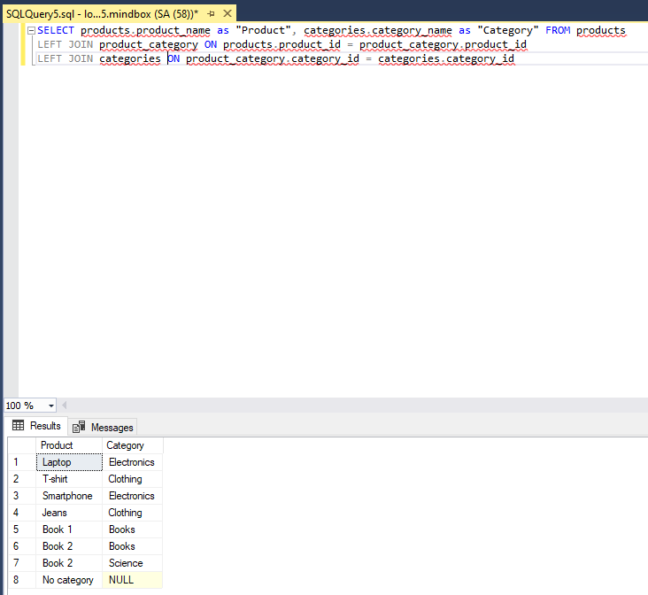

# MindboxTestAssignment
## Вопрос №2
Выполните практическое задание ниже.  
Отклики без выполненного задания не будут рассмотрены.  
Пожалуйста, не пишите код внутри формы ответов, разместите его на Github и приложите
ссылку. Если в задании что-то непонятно, опишите возникшие вопросы и сделанные
предположения. Например, в комментариях в коде.  
Задание:  
Напишите на C# библиотеку для поставки внешним клиентам, которая умеет вычислять
площадь круга по радиусу и треугольника по трем сторонам. Дополнительно к
работоспособности оценим:  

 - Юнит-тесты  
 - Легкость добавления других фигур  
 - Вычисление площади фигуры без знания типа фигуры в compile-time  
 - Проверку на то, является ли треугольник прямоугольным  
 ## Вопрос №3
В базе данных MS SQL Server есть продукты и категории. Одному продукту может
соответствовать много категорий, в одной категории может быть много продуктов. Напишите
SQL запрос для выбора всех пар «Имя продукта – Имя категории». Если у продукта нет
категорий, то его имя все равно должно выводиться.
 ## Ответ на Вопрос №3 (SQL задача)
 ```SQL
SELECT products.product_name as "Product", categories.category_name as "Category" FROM products
LEFT JOIN product_category ON products.product_id = product_category.product_id
LEFT JOIN categories ON product_category.category_id = categories.category_id
```
(При условии что структура БД имеет следующий вид)
```SQL
CREATE TABLE categories (
    category_id INT PRIMARY KEY,
    category_name NVARCHAR(50)
);

CREATE TABLE products (
    product_id INT PRIMARY KEY,
    product_name NVARCHAR(50)
);

CREATE TABLE product_category (
    product_id INT,
    category_id INT,
    PRIMARY KEY (product_id, category_id),
    FOREIGN KEY (product_id) REFERENCES products(product_id),
    FOREIGN KEY (category_id) REFERENCES categories(category_id)
);
```
## Пример выполнения запроса


```SQL
INSERT INTO categories (category_id, category_name) VALUES (1, N'Electronics');
INSERT INTO categories (category_id, category_name) VALUES (2, N'Clothing');
INSERT INTO categories (category_id, category_name) VALUES (3, N'Books');
INSERT INTO categories (category_id, category_name) VALUES (4, N'No products');
INSERT INTO categories (category_id, category_name) VALUES (5, N'Science');

INSERT INTO products (product_id, product_name) VALUES (1, N'Laptop');
INSERT INTO products (product_id, product_name) VALUES (2, N'T-shirt');
INSERT INTO products (product_id, product_name) VALUES (3, N'Smartphone');
INSERT INTO products (product_id, product_name) VALUES (4, N'Jeans');
INSERT INTO products (product_id, product_name) VALUES (5, N'Book 1');
INSERT INTO products (product_id, product_name) VALUES (6, N'Book 2');
INSERT INTO products (product_id, product_name) VALUES (7, N'No category');

INSERT INTO product_category (product_id, category_id) VALUES (1, 1);
INSERT INTO product_category (product_id, category_id) VALUES (2, 2);
INSERT INTO product_category (product_id, category_id) VALUES (3, 1);
INSERT INTO product_category (product_id, category_id) VALUES (4, 2);
INSERT INTO product_category (product_id, category_id) VALUES (5, 3);
INSERT INTO product_category (product_id, category_id) VALUES (6, 3);
INSERT INTO product_category (product_id, category_id) VALUES (6, 5);
```